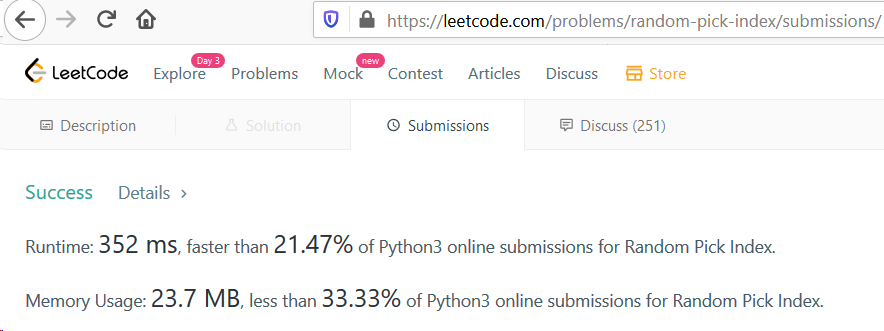

# 398. Random Pick Index
#### Description
Given an array of integers with possible duplicates, randomly output the index of a given target number. You can assume that the given target number must exist in the array.

Note:
The array size can be very large. Solution that uses too much extra space will not pass the judge.

Example:
```

int[] nums = new int[] {1,2,3,3,3};
Solution solution = new Solution(nums);

// pick(3) should return either index 2, 3, or 4 randomly. Each index should have equal probability of returning.
solution.pick(3);

// pick(1) should return 0. Since in the array only nums[0] is equal to 1.
solution.pick(1);

```

## Solution
Here is my solution:
1. Traverse nums list and store all the indexs with same value in dictonery.
  For above example our dictionary will look like this:
    
```
{
  1: [0], 
  2: [1], 
  3: [2, 3, 4]
}
```
  We should do this in **\_\_init\_\_** function
  
``` python
def __init__(self, nums: List[int]):
    # defining dictionary
    self.arr = dict()
    # start traversing nums list
    for i in range(len(nums)):
        # for the first time that we visit a value, we should init it's dictionary value with an empty array.
        if not nums[i] in self.arr:
            self.arr[nums[i]] = []
        # we append all the indexes of the same key as its values
        self.arr[nums[i]].append(i)
```
  
2. Selecting a random index of the give target. We are going to use random.choice() function for this task.

``` python
def pick(self, target: int) -> int:
    # use target as a key to access its list of index
    return random.choice(self.arr[target])
```

### Conclusion
This is the most straight forward solution, and probably not the best one. 


  
